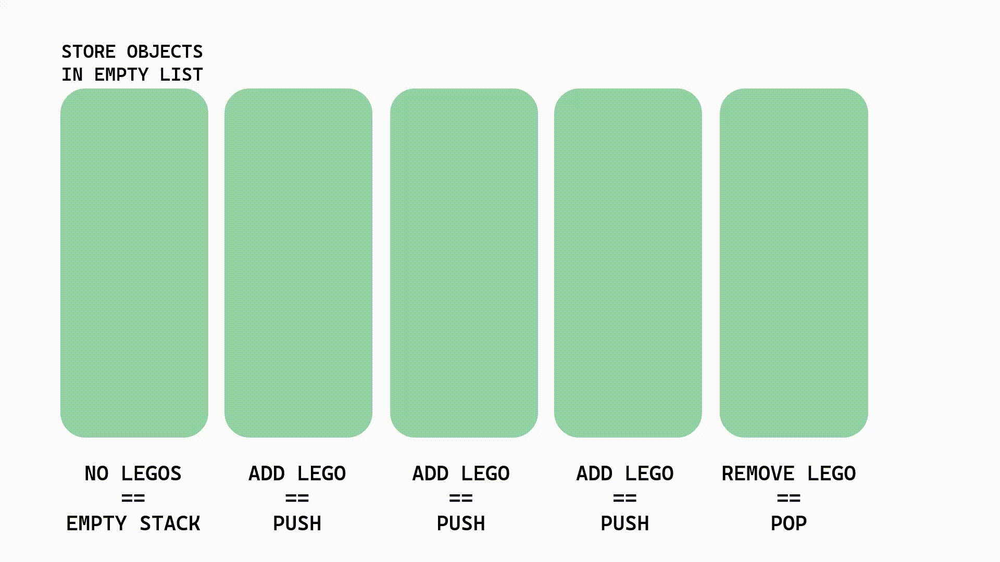
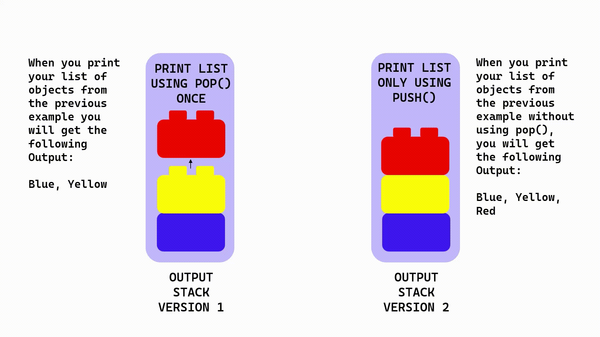
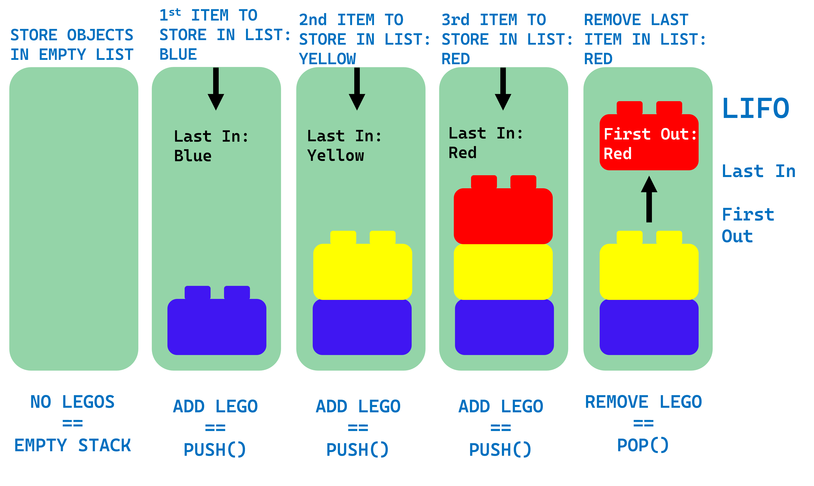

# STACKS

<h9>[iStock Image for Stack of LEGOS](https://www.istockphoto.com/photo/chart-from-lego-gm458114131-19528858)</h9>

<h2>What are Stacks?</h2>

Let us begin with the [*Oxford Language Dictionary* defintion for Stack](https://www.google.com/search?q=stack+definition&rlz=1C1JZAP_esUS929US929&oq=stack+definition&aqs=chrome..69i57j0i20i263i512j0i512l7j0i20i263i512.2875j1j4&sourceid=chrome&ie=UTF-8): 

"A pile of objects, typically one that is neatly arranged."

- Example 1.
**"a stack of boxes"**

- Example 2.
**"a stack of LEGOS"**
    - *Keep the LEGOS example in mind throughout the reading*.

 *Stacks* for Software are no different from the day-to-day noun we use for *stack*. The unique difference is the usage it has in the aspect of Software creation:

 Stacks in programming Software are a set of objects added above eachother in sequential order and can be stored into different formats. With Python Programming Language, Stacks can us *lists, enqueue, and dequeue*. You can only get rid of an object by removing the last object you added into the list. 

 **Here is a visual for you:**

 - INPUT of objects stored in an *empty list*, step by step, using the Stack Data Structure and calling the function **push()**:

 
 - OUTPUT of List of objects using **pop()** once (remove) vs. only using **push()** three times (add):

 

<h2>Why are they important?</h2>

Many programs we use today require the usage of stacks so we can easily *retrieve, remove,* and *display* data in the order in which it it is stored.

It's also important for you to know that being able to remove the last item added to the Stack consists of what can be a golden-rule to Stack patterns: **LIFO**.

**LIFO** means:
1. The **L**ast item **I**n is the **F**irst item **O**ut.

<h2>When do we use them?</h2>

Pause for a moment and think of Software that allows you use Stacks. Here are two common situations:

**SITUATION A:**
-  We add data, later on, we use **UNDO** to remove last item input.

    1. **CAD tools**: AutoCAD, Krita, Logism Evolution, and more, allow you to **add** or **push()** items into your main design pages, and you can easily **remove** or **pop()** the last item added by prompting  **UNDO**. 
    2. **Word/Image Processing programs**: like Word, Notes, PowerPoint, Adobe Lightroom, etc.

    3. **IDE's:** Visual Studio Code, Visual Studio Community, Eclipse, IntelliJ, etc.
    

**SITUATION B:**

- We *push()* data in sequential order and the function *pop()* only takes place when certain requirements are met.
    1. **Microsoft Solitaire:** To win, you **stack**, **add**, or **push()** cards in rows in descending order. Once you have done this, the game proceeds to **remove** or **pop()** all cards in asccending  order.

    2. **Tic-Tac-Toe:** some versions of this game resets after **X** or **O** wins, **only** if you click *Play Again* - this calls the **pop()** function on all slots used for the game. You play by adding X or O when players are prompted: **push(X)** or **push(O)**.

<h2> O - Notation for Common Stack Operations </h2>

We have been using Stack Operations as we have learned about Stacks. It is good for you to be able to identify them to determine their Algorithmic Efficiency when debugging or building different ypes of Software. 

The common *O - Notation* Stack Operations are the following:

- **push(x)**: Last In of data. *O(1) - best efficiency as it only adds x to the end of the list*
    
- **pop()**: Last In of data is First Out. *O(1) - best efficiency as it removes x from the end of the list*
    
- **size()**: Returns length of list or stack. *O(1) - best efficiency as it outputs the size of the stack.*
    
- **empty()**: Output is TRUE when length of stack is zero. *O(1) - best efficiency as it only checks size of stack and Outputs TRUE when zero*
    

# <h3> Examples:</h3>

- [See Problem 1.](2.STACK_PROBLEM_1.py)
- [Solve Problem 2.](3.STACK_PROBLEM_2.py)
    - [*Solution for problem 2.*](4.SOLUTION_PROBLEM_2.py)

#
[Back to main README](../README.md)

